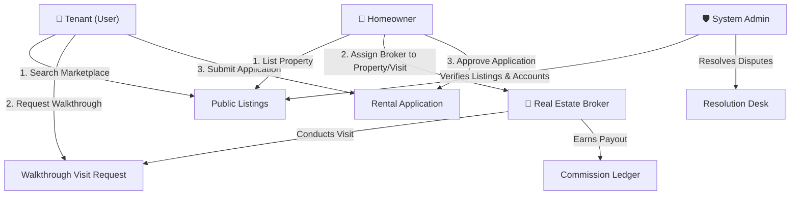

# 🏡 House Rental Management System (PropTech OS)

A high-trust, production-ready **Online Rental Property Management Platform** built with raw **PHP 8.x**, **MVC Architecture**, **MySQL 8.0**, and **Tailwind CSS**.

---

### 👥 Team Members & Contribution Matrix

This project was built collaboratively with dedicated module responsibilities:

| Contributor | GitHub Profile | Assigned Module & Deliverables |
| :--- | :--- | :--- |
| **Zulqarnain** (Lead) | [@Zul-Qarnain](https://github.com/Zul-Qarnain) | Core MVC Architecture, Database Schema, Auth System, Tenant Portal & Public Marketplace |
| **Naimul (Tashin)** | [@Tashin90](https://github.com/Tashin90) | Admin Control Desk, Property Verification, Complaint Resolution Desk & Audit Trail (`admin_actions`) |
| **Rahul** | [@Rahul53662](https://github.com/Rahul53662) | Homeowner Portfolio, Listing Wizard, Rental Request Inbox & Review Reply System |
| **Labib** | [@Md-Mahir-Labib](https://github.com/Md-Mahir-Labib) | Broker Portal, Assigned Property Ledger, Walkthrough Visit Execution & Commission Payout Ledger |

---

### 💻 Running Locally on XAMPP / Localhost (For Faculty & Team Evaluation)

Follow these **5 simple steps** to set up and run the project locally using XAMPP:

#### 1️⃣ Copy Project into XAMPP `htdocs`
Place the repository folder (`House-Rental-System`) inside your XAMPP web root directory:
- **Windows:** `C:\xampp\htdocs\House-Rental-System`
- **Linux:** `/opt/lampp/htdocs/House-Rental-System`
- **macOS:** `/Applications/XAMPP/htdocs/House-Rental-System`

#### 2️⃣ Start Apache & MySQL
Open **XAMPP Control Panel** and click **Start** for both **Apache** and **MySQL**.

#### 3️⃣ Import Database in phpMyAdmin
1. Open your browser and go to: `http://localhost/phpmyadmin`
2. Click **New** $\rightarrow$ Create a database named **`defaultdb`** (Collation: `utf8mb4_general_ci`).
3. Select `defaultdb` $\rightarrow$ Click **Import**.
4. Import `database/schema.sql` (and `database/seed.sql` to populate demo accounts & listings).

#### 4️⃣ Configure Local Credentials
Create a file named `config/config.local.php` inside the project folder:
```php
<?php
return [
    'DB_HOST' => '127.0.0.1',
    'DB_PORT' => 3306,
    'DB_NAME' => 'defaultdb',
    'DB_USER' => 'root',  // Default XAMPP username
    'DB_PASS' => '',      // Default XAMPP password is empty
    'DB_SSL_CA' => null,
];
```

#### 5️⃣ Open Website in Browser
- **Option A (PHP Built-in Server - Recommended):**  
  Open terminal inside `House-Rental-System` and run:
  ```bash
  php -S 127.0.0.1:8000 -t public public/index.php
  ```
  Visit: 👉 **`http://127.0.0.1:8000`**

- **Option B (Direct XAMPP URL):**  
  Visit: 👉 **`http://localhost/House-Rental-System/`**

---

### 🔑 Demo Accounts & Passwords (Password for ALL: `password123`)

| Role | Email | Password |
| :--- | :--- | :--- |
| **System Admin** | `admin@proptech.com` | `password123` |
| **Homeowner** | `owner@proptech.com` | `password123` |
| **Tenant** | `tenant@proptech.com` | `password123` |
| **Broker** | `broker@proptech.com` | `password123` |

---

### 🔑 User Roles & Feature Breakdown ("Who Has Which Features")



#### 🛡️ 1. System Admin (`admin@proptech.com`)
- **User Account Management:** Activate or deactivate platform user accounts (`users.is_active`).
- **Property Approvals:** Review and approve/verify newly submitted listings before public launch.
- **Resolution Desk:** Manage and resolve user or property complaints.
- **Audit Logging:** View persistent administrative security logs (`admin_actions`).

#### 🏡 2. Homeowner (`owner@proptech.com`)
- **Listing Portfolio:** Create and edit property listings (rent price, city, cover photos, specs).
- **Broker Management:** Select and assign licensed real estate brokers directly to properties and visit requests.
- **Status Toggling:** Update property availability (`available`, `pending`, `rented`).
- **Application Inbox:** 1-click Approve/Reject actions on incoming tenant rental requests.
- **Review Replies:** Post responses to tenant ratings and reviews.

#### 👤 3. Tenant / General User (`tenant@proptech.com`)
- **Marketplace Search:** Filter property catalog by city, price range, and bedroom count.
- **Walkthrough Visit Requests:** Select preferred date and time to request a property walkthrough visit.
- **Rental Application Checkout:** Submit formal rental applications with move-in dates and messages.
- **Tenant Dashboard:** Manage active lease agreements, requested visits, and rental request status.
- **Ratings & Reviews:** Rate and review rented properties.

#### 💼 4. Real Estate Broker (`broker@proptech.com`)
- **Assigned Client Ledger:** View client property listings assigned to them by Homeowners.
- **Walkthrough Visit Execution:** View walkthrough visits assigned by Homeowners and mark them as `completed`.
- **Commission Ledger:** Track automatically calculated commission payouts (50% of 1st month rent) on closed deals.

---

### ⚙️ GitHub to Website CI/CD Deployment Pipeline Workflow

Automated testing and deployment configured in [.github/workflows/ci-cd.yml](file:///.github/workflows/ci-cd.yml):

```
┌─────────────────────────┐     ┌──────────────────────────┐     ┌─────────────────────────┐
│  Git Push to main       │ ──> │ Ephemeral MySQL 8.0 Test │ ──> │ Inject Production Config│
└─────────────────────────┘     └──────────────────────────┘     └─────────────────────────┘
                                                                              │
                                                                              ▼
┌─────────────────────────┐                                      ┌─────────────────────────┐
│ Live Website Active     │ <─────────────────────────────────── │ FTP Deploy into htdocs/ │
└─────────────────────────┘                                      └─────────────────────────┘
```

#### Pipeline Steps:
1. **Automated Testing Stage:**
   - Spins up an ephemeral **MySQL 8.0** service container on GitHub Actions runners (`ubuntu-latest`).
   - Loads `database/schema.sql` and `database/seed.sql` into the container.
   - Runs **9 unit & integration test suites** via `php tests/run_tests.php`.
2. **Secrets & Production Configuration Stage:**
   - Injects encrypted GitHub Repository Secrets (`INFINITYFREE_DB_HOST`, `INFINITYFREE_DB_USER`, `INFINITYFREE_DB_PASS`, `INFINITYFREE_FTP_*`) into `config/config.local.php`.
3. **Automated FTP Deployment:**
   - Uses `SamKirkland/FTP-Deploy-Action@v4.3.5` to deploy clean production files directly into InfinityFree's **`htdocs/`** web root directory.

---

### 🧪 Running Automated Unit Tests

Run the test suite (9 Test Suites):
```bash
php tests/run_tests.php
```
